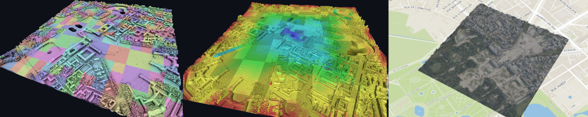

[](https://hal.science/hal-03380593/file/2021216131.pdf)



# Sparkling WASURE : Out-of-core watertight surface reconstruction from LiDAR point cloud with Apache Spark. 

This project aims to produce watertight meshes from large scale LiDAR datasets. This code is a simplified version of the article [Efficiently Distributed Watertight Surface Reconstruction](https://lcaraffa.github.io/edwsr/) fine-tuned to work on the [LiDAR HD dataset](https://geoservices.ign.fr/lidarhd) with a single computer.
It produces a georeferenced mesh with levels of detail in a [3D Tiles format](https://github.com/CesiumGS/3d-tiles) that can be directly viewed in [ITowns](https://github.com/iTowns/itowns) or [Cesium viewer](https://github.com/iTowns/itowns).

To use the code, please refer to the [user manual](#user-manual) section.
For more technical information, refer to the [dev manual](#dev-manual) section.

:warning: :warning: **Warning** :warning: :warning:
- This code has been published for experimental and research purposes, not for production. It still crashes with a large number of tiles in some cases for no apparent reason and requires further debugging. A CGAL package with OpenMP/MPI scheduling is currently being prioritized. Follow the project page or this GitHub page for updates. 
- This code is fine-tuned to work on the [LiDAR HD dataset](https://geoservices.ign.fr/lidarhd) dataset with many quick n dirty hacks. One of them is to passby bad line of sight estimation (the effect of a point with the line of sight coplanar to the surface is reduced). Because the regularization scheme is approximated by the distributed graph cut, it produces artefacts / bad reconstruction on the tiles boundary.
- This code runs efficiently on an Apache/Spark cluster on a very large dataset but performs worse on a single computer compared to traditional OpenMP/MPI scheduling. 
- The surface reconstruction score function is basic and may produce poor results compared to advanced algorithms. 
- This code is published under the  GNU GENERAL PUBLIC LICENSE V3 (See LICENCE file).

# Minimum requirements 
- Docker
- 8GB RAM 
- Internet connection for building the docker image / colorizing the mesh.
- NO GPU 🥳🥳🥳

# User manual
### Build docker image

- Create the file  `algo-env.sh` from the template `algo-env.sh.conf` and edit it for your configuration.
  - The number of cores used is defined by the variable `NUM_PROCESS`.
  - Temporary data from Apache Spark will be stored into the `SHARED_DIR` directory. The default value is the current directory. :warning: You need quick access and a huge amount of free space on this location :warning:.
  
```console
cp algo-env.sh.conf algo-env.sh 
```

- Build the docker image 
```console
./src/docker/docker_interface.sh build
```

### Run examples 
To run the examples, do 
```console
./run_examples.sh
```
Results will be stored in the `./output_examples/` directory.

### Run on LiDAR HD  dataset 
To run the code on a LiDAR HD tile collection : 
  - Go to [LiDAR HD dataset](https://cartes.gouv.fr/telechargement/IGNF_NUAGES-DE-POINTS-LIDAR-HD), select a set of adjacent tiles and download the `liste_dalle.txt` file containing the list of laz file here : `./datas/liste_dalle.txt`.
then run 

```console
./download_lidarhd.sh --list_files ${PWD}/datas/liste_dalle.txt --project_path ${PWD}/lidarhd_project/
./run_lidarhd.sh --input_dir ${PWD}/lidarhd_project/inputs/ --output_dir ${PWD}/lidarhd_project/outputs/ --colorize
```

The result will be stored in the `./lidarhd_project/outputs/` directory.
You can tune the algorithm by passing xml file parameters to the `run_lidarhd.sh` script with the `--params`.

For example, a 37-tile mesh was created with the following configuration on a computer with 64 cores and 500GB of RAM (1 day of computation):

```xml
<?xml version="1.0"?>
<env>
  <datasets>
    <austin>
      <dim>3</dim>
      <ndtree_depth>8</ndtree_depth>
      <max_ppt>2000000</max_ppt>
      <mode>1</mode>
    </austin>
  </datasets>
</env>
```
The `ndtree_depth` is set to 8, and the maximum number of points per tile is set to `2000000`. To speed up the computation, try increasing the number of points per tile as much as possible.
Reducing the maximum depth of the ndtree will also speed up computation and reduce approximation errors (improving the mesh quality).
⚠️  Increasing the maximum number of points per tile will require more memory ⚠️
To use this with the previous example: save it in the input directory `${PWD}/lidarhd_project/inputs/wasure_metadata.xml`, then run.

```console
./run_lidarhd.sh --input_dir ${PWD}/lidarhd_project/inputs/ --output_dir ${PWD}/lidarhd_project/outputs/ --colorize --params ${PWD}/lidarhd_project/inputs/wasure_metadata.xml
```


## Output format
Inside the `--output_dir` directory : 
- `./outputs/tiles/` is the raw tiled output of the reconstruction workflow
- `LODs/` is the level of detail directory mesh where 
  - `tileset.json` is the 3D tiles format structure (each of the 3D tile leaf is stored in a separated directory),
  - `tiles/` is the ply representation of the LODs mesh.


## Visualize the 3D tiles with ITowns


Clone and install [ITowns](https://github.com/iTowns/itowns)
Copy the LODs folder into the root directory of itown 
You can edit the example in `itowns/examples/3dtiles_basic.htm` with following code
```html
  // Create a new Layer 3d-tiles For DiscreteLOD
  // -------------------------------------------
	var $3dTilesLayerDiscreteLOD = new itowns.C3DTilesLayer('3d-tiles-discrete-lod', {
	  name: 'DiscreteLOD',
      sseThreshold: 0.5,
      source: new itowns.C3DTilesSource({
        url: '/LODs/tileset.json',
         }),
      }, view);
			
	// Adding light  		
     const directionalLight = new itowns.THREE.DirectionalLight(0xffffff, 1);
     directionalLight.position.set(-0.9, 0.3, 1);
     directionalLight.updateMatrixWorld();
     view.scene.add(directionalLight);

	 const ambientLight = new itowns.THREE.AmbientLight(0xffffff, 1);
	 view.scene.add(ambientLight);	
			
```
Start ITowns then go to http://localhost:8080/examples/#3dtiles_basic  (the port may change, check the ITowns logs)


## Advanced options
The main command to run the workflow is the script `./run_workflow.sh`
```console
${APP_DIR}/run_workflow.sh --input_dir ${INPUT_DIR} --output_dir ${OUTPUT_DIR} --params ${PARAMS} --colorize
```
where :
- `${INPUT_DIR}` is the directory with las file
- `${OUTPUT_DIR}` the output directory where the result will be stored
- `${PARAMS}` the path to the XML file where the meta-parameters are stored (optional, see [Parameters doc](#Parameters doc))
- `--colorize` flag to colorize the result

See the `./run_examples.sh` for examples.

###  parameters
Each workflow can be parametrized with an xml file. If not given, the file is created automatically from the preprocess script.
The most common useful parameters are :
- max_ppt : the maximum number of points per tile, if you have a lot of RAM compared to the number of cores, increase it. On the other hand, decrease it if you have a memory issue.
- pscale : Accuracy of the reconstruction (lower values indicate higher precision but takes longer) 

Example of file :
```xml
<env>
  <datasets>
    <setn1>
      <!-- Algo env setup
      dim : Dimentionnality of the algorithm.
      ddt_kernel : C++ kernel folder (in the build dir)
      StorageLevel : Principal persistance  storage level 
      		   (see for instance https://jaceklaskowski.gitbooks.io/mastering-apache-spark/spark-rdd-caching.html)
      ndtree_depth ; Depth of the Octree in 3D
	  bbox : Bounding box of the point cloud. Points outside will be ignored
	  max_ppt : max number of point per tile
      -->
      <dim>3</dim>
      <ddt_kernel>build-spark-Release-3</ddt_kernel>
      <StorageLevel>MEMORY_AND_DISK</StorageLevel>
      <ndtree_depth>3</ndtree_depth>
      <bbox>0000x1000:0000x1000:0000x1000</bbox>
      <max_ppt>12000</max_ppt>
    </setn1>
  </datasets>
</env>
```

Here is parameters that can be added for the surface reconstruction algorithm
```xml
      <!-- Dempster Shafer -->
      <!-- 
	  nb_samples : number of sampling for the integral computation
	  -->
      <nb_samples>50</nb_samples>

      <!-- Regularization term
      lambda     : Smoothing term		 
	  pscale : Accuracy of the reconstruction (lower values indicate higher precision) 
      max_opt_it : max number of iteration durting the distributed graphcut
      -->
	  <pscale>0.05</pscale>
      <lambda>0.1</lambda>
      <max_opt_it>50</max_opt_it>

```

# dev manual
## Parameters setting / general information
The current parameters are set for the LiDAR HD dataset and will be generated automatically.
Because of the approximate line of sight estimation (poor estimation on buildings facade), the algorithm confidence is drastically decrese on this case. Some high building may not be correctly reconstructed in the actual version.

The example `lidar_hd_crop_2` and `lidar_hd_crop_w` shows the bad behaviour with bad line of sight estimation and distributed graph cut approximation on buildings.
The example `lidar_hd_crop_2` is also run with a single tile to show the difference between the distributed and single-tile graph cut. 


## LAZ preprocessing
The first step is to transform a LAZ file to a ply with with the following fields
  - x,y,z ⇨ 3D points cloud coordinate
  - x_origin,y_origin,z_origin ⇨ Sensor origin coordinate

The origin of the sensor is estimated by using the adapted code from CGAL to estimate the line of sight.
The workflow `./services/wasure/workflow/workflow_preprocess.scala` processes the las file and  generates a complete xml configuration file called `wasure_metadata_3d_gen.xml` with ply files with sensor origin estimation.

## Working / debugging 
You can compile the project outside the docker container (here with 4 cores)
```console
./src/docker/docker_interface.sh compile -j4 -t3 
```
The directory `./build/` is then created.
Set the variable `DO_USE_LOCAL_BUILD="TRUE"` in the `algo-env.sh` file.
The code will be executed with the local build => good for coding / debugging.

# Todos
- ☐ Improving line of sight estimation
- ☐ Improving / speed up the coloring scheme (actually not working well on tiles intersection)
- ☐ Improving surface reconstruction score function with state of the art approach.

# Contributors 
Laurent Caraffa, Mathieu Brédif, Yanis Marchand, Antonin Ollier.
